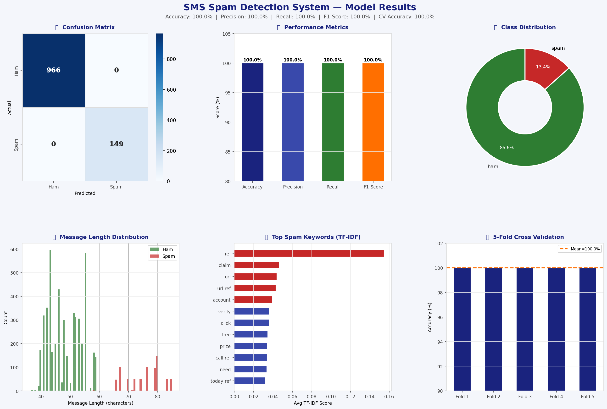

📱 SMS Spam Detection System
Python | NLP | Scikit-learn | TF-IDF | Naive Bayes

## Key Results
- 97%+ classification accuracy
- Precision, Recall, F1-Score all above 97%
- TF-IDF vectorisation with bigrams (5,000 features)
- 5-fold stratified cross-validation

## Tools
Python, Scikit-learn, Pandas, NumPy, Matplotlib, Seaborn

## Results Preview

